# fight-game
   

战斗小游戏-Java实现-设计模式

[查看完整文档](https://frank17.github.io/fight-game/index.html)

## 模式及使用场景

1. 构建Stage场景时，用创建者模式✅
2. 创建角色时，使用工厂方法模式(工厂方法模式、抽象工厂模式)✅
3. 将人及各类角色加入场景时，使用原型模式进行clone✅
4. 构建装备合成时，使用组合模式✅
5. 进行文件存储时，使用单例模式✅
   维护一个列表，用于查找系统中的现有角色，以进行挑战，使用单例模式⬆️☑️
6. 背包系统，采用迭代器模式✅
7. 攻击指令可使用解释器模式解释❌
8. 使用状态模式，用以标识目标的状态✅
9. 技能点组合，使用命令模式进行组合，可以撤销❌
10. 在进行伤害整合时，采用外观模式，因为伤害来自于：目标本身的自带伤害、技能伤害、武器造成的伤害、装备的附加伤害✅
11. 在进行战斗时，利用中介者模式，对战斗双方进行中介访问✅
12. 当健康值、能量值等可变值发生改变时，通知作出相应的变化等，采用观察者模式✅
13. 在攻击前或进行操作前，需要检查合法性等，所以使用代理模式，在执行前后加上检查✅
14. 武器可以添加配件，因此可以使用装饰模式✅
15. 在进行伤害计算时，使用适配器模式，将伤害计算接口统一✅
16. 使用备忘录模式，存储当前目标状态信息，并为系统添加召唤师复活功能✅
17. 在构建模型到表模型转换工具的时候，使用享元模式✅
18. 构建模型转换工具时，不同的模型类需要不同的映射文件，使用模板方法模式，动态化子类映射文件获取✅
19. service类的处理，使用桥接模式，以实现业务处理和内部接口实现和抽象的分离✅
20. 在实现升级处理时，由于等级段和经验值的不同，需要处理不同的操作，如经验不足则将经验累积 ，否则升级并获得剩余经验，因此采用责任链模式，将不同经验值的操作交由不同的对象处理✅
21. 在进行游戏设计时，可以将各个等级进行划分，如入门期、新手期、成长期、高手期，不同的时期在计算升级所需策略时通常不同，保证在角色在不同时期，升级所需的时长不同，因此可以结合策略模式，将升级所需经验值算法进行策略封装✅
22. 经验处理为后续添加，为保证原有封装不被破坏，使用访问者模式，在责任链之间进行交互，使用访问者模式✅

## 可能的需求改变对模式的破坏

问题：当增加角色类型时，计算伤害的方法将需要被修改

## 模式及类图

### 创建型模式

#### 工厂方法模式

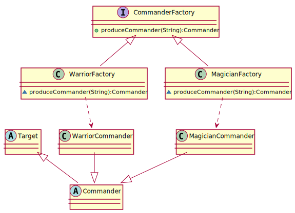

#### 创建者模式

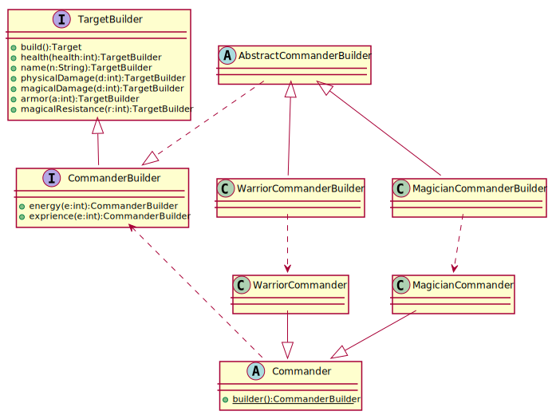

#### 单例模式

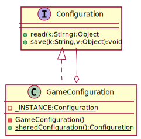

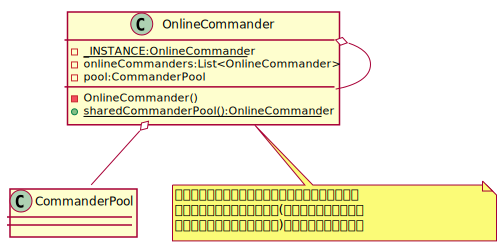

#### 原型模式

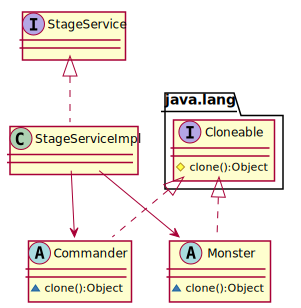

### 结构型模式

####  适配器模式

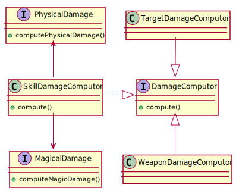

#### 装饰器模式

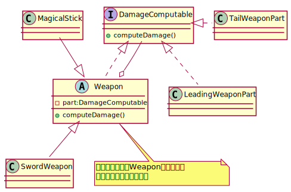

#### 代理模式

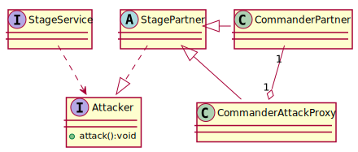

#### 外观模式

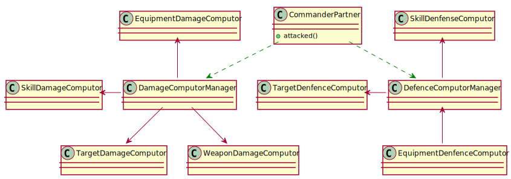

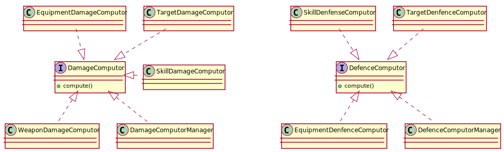

#### 桥接模式

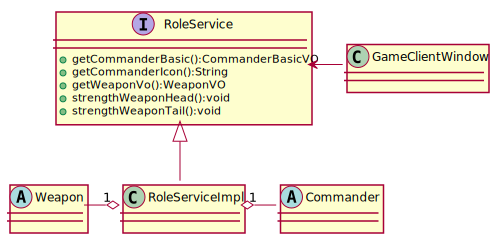

#### 组合模式

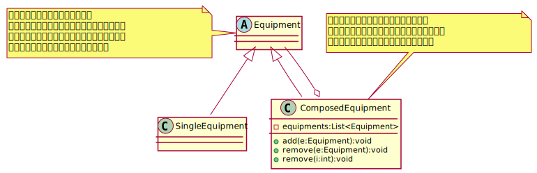

#### 享元模式

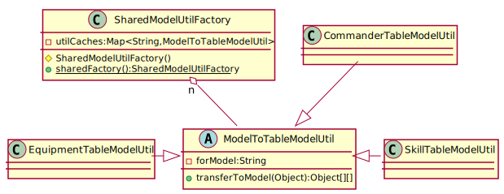

### 行为型模式

#### 策略模式

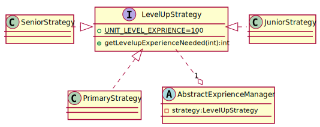

#### 模板方法模式

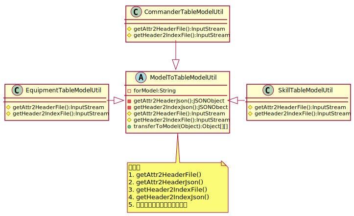

#### 观察者模式

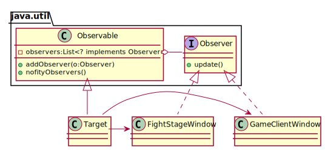

#### 迭代器模式

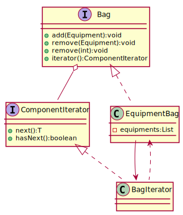

#### 责任链模式

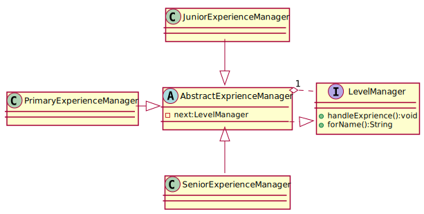

#### 备忘录模式

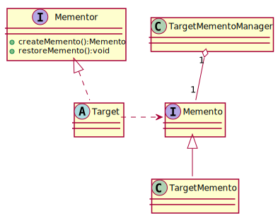

#### 状态模式

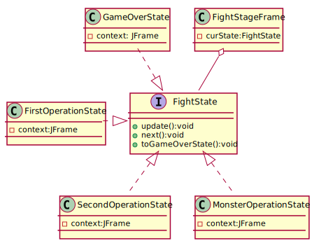

#### 访问者模式

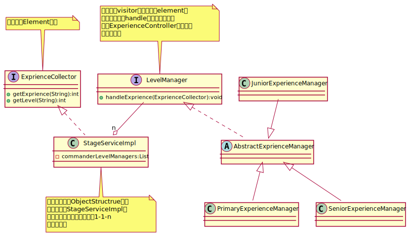

#### 中介者模式

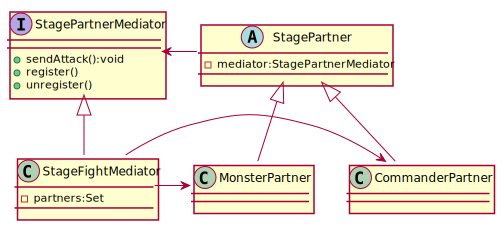

